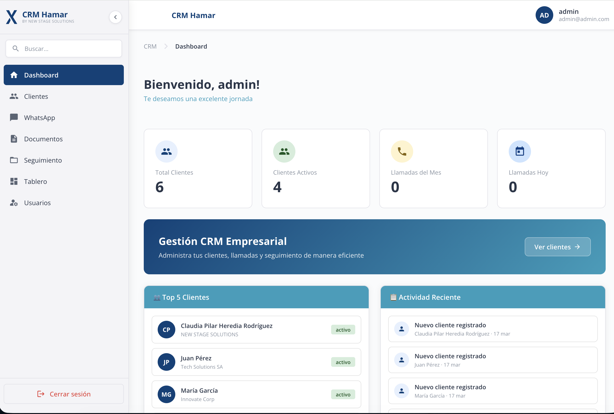
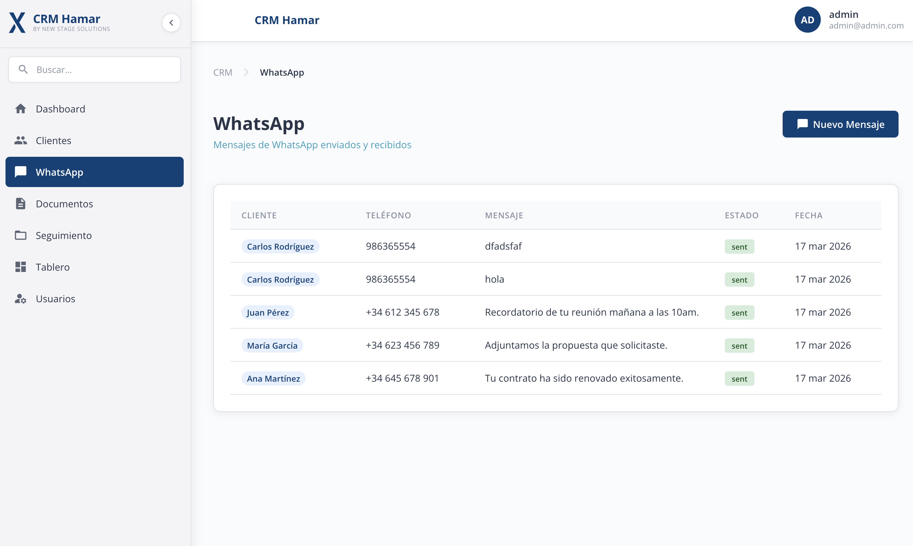
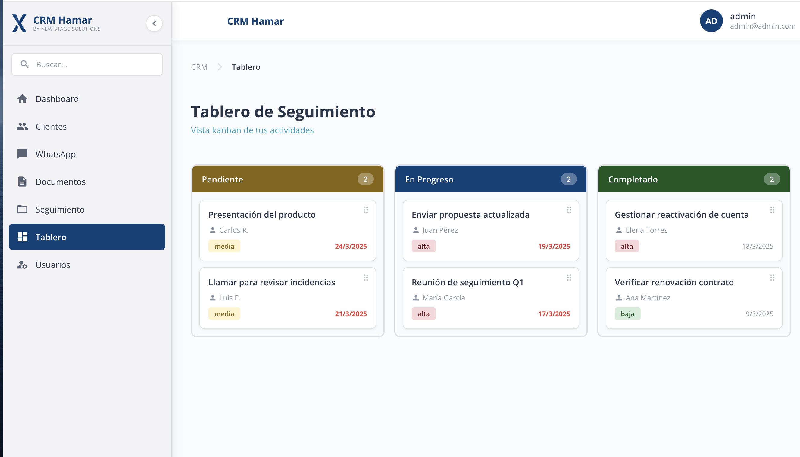

# CRM Hamar 🚀

> A full-featured business CRM with WhatsApp integration, Kanban board, and real-time KPI dashboard — built in 2 days using Google Antigravity + Claude Code.


## 🌐 Live Demo

🔗 **[crmnss.vercel.app](https://crmnss.vercel.app/login)**

| Field | Value |
|-------|-------|
| Email | admin@admin.com |
| Password | 12345 |

---

## ✨ Features

- **Dashboard** — Real-time KPIs: total clients, active clients, monthly calls, daily calls. Top 5 clients and recent activity feed.
- **Client Management** — Full CRUD for clients with status tracking (active/inactive) and company association.
- **WhatsApp Module** — Log and track WhatsApp messages sent to clients. View message history by contact with status and timestamps.
- **Kanban Board** — Task tracking with three columns (Pending, In Progress, Completed), priority levels (high/medium/low), due dates, and assigned contacts.
- **Document Management** — Upload and organize documents linked to clients.
- **Follow-up Tracking** — Log and monitor follow-up activities per client.
- **User Management** — Multi-user support with role-based access control.
- **Global Search** — Search across clients, documents, and activities.

---

## 🛠️ Tech Stack

| Layer | Technology |
|-------|-----------|
| Frontend | React.js |
| Styling | Tailwind CSS |
| Backend / Database | Supabase (PostgreSQL + Auth + Realtime) |
| Deployment | Vercel |
| Language | JavaScript |
| AI Dev Tools | Google Antigravity + Claude Code |

---

## 📸 Screenshots

### Dashboard


### WhatsApp Module


### Kanban Board


---

## 🚀 Getting Started

### Prerequisites

- Node.js 18+
- A Supabase account

### Installation

```bash
# Clone the repository
git clone https://github.com/cheredia10/Crmnss.git
cd Crmnss

# Install dependencies
npm install

# Set up environment variables
cp .env.example .env.local
```

### Environment Variables

Create a `.env.local` file with your Supabase credentials:

```env
VITE_SUPABASE_URL=your_supabase_project_url
VITE_SUPABASE_ANON_KEY=your_supabase_anon_key
```

### Run locally

```bash
npm run dev
```

Open [http://localhost:5173](http://localhost:5173) in your browser.

---

## 🗄️ Database Schema

The app uses Supabase with the following main tables:

- `clients` — client profiles with status and company
- `whatsapp_messages` — message history linked to clients
- `tasks` — Kanban tasks with priority, status, and due date
- `documents` — files linked to clients
- `follow_ups` — follow-up activity log
- `users` — app users with role assignments

---

## 🤖 Built with AI-Assisted Development

This project was built in **2 days** using an agent-first development workflow:

- **Google Antigravity** — multi-agent orchestration across editor, terminal, and browser
- **Claude Code** — feature implementation, Supabase integration, and component generation
- Each feature started with a markdown spec file before any agent wrote code
- Every PR was reviewed and QA'd on the running app before merging

---

## 📁 Project Structure

```
src/
├── components/       # Reusable UI components
├── pages/            # Route-level page components
│   ├── Dashboard/
│   ├── Clients/
│   ├── WhatsApp/
│   ├── Kanban/
│   ├── Documents/
│   └── Users/
├── lib/              # Supabase client and utilities
├── hooks/            # Custom React hooks
└── types/            # TypeScript type definitions
```

---

## 📄 License

MIT License — feel free to use this project as a reference or starting point.

---

## 👤 Author

**Claudia Heredia**
- GitHub: [@cheredia10](https://github.com/cheredia10)
- Upwork: [Full-Stack Developer Profile](https://www.upwork.com)

---

> Built with ❤️ using React · Supabase · Vercel · Google Antigravity · Claude Code
